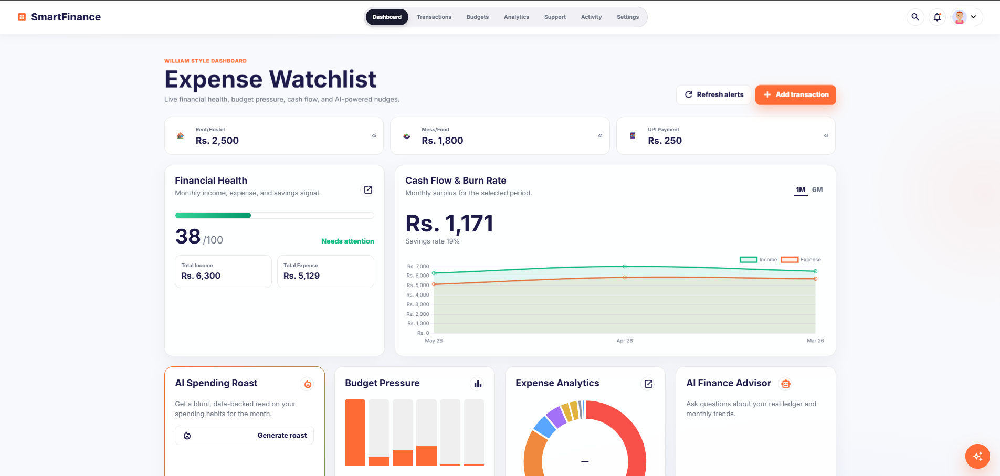

# 💎 SmartFinance

<p align="center">
  
</p>

<p align="center">
  <a href="https://github.com/IrfanCodesBTW/SmartFinance">
    
  </a>
  
  
  
  
  
</p>

---

**SmartFinance** is an elite, SQL-first personal finance ecosystem designed specifically for Indian college students, freelancers, and young professionals. It's not just a tracker; it's an AI-powered financial companion that combines robust DBMS principles with modern glassmorphism aesthetics and cutting-edge predictive analytics.

## ✨ Why SmartFinance?

In a world of complex banking apps, SmartFinance offers a **clean, "India-first" approach**. Whether it's tracking your daily *Chai* expenses, managing your hostel mess bills, or planning for your next tech upgrade, SmartFinance makes your money work for you.

---

## 🚀 Key Features

### 🧠 AI-Powered Intelligence
- **AI Roast Advisor:** Get a brutally honest (and hilarious) critique of your spending habits powered by **Groq (Llama 3.1)**. It knows your name, and it's not afraid to use it.
- **Predictive Spend Alerts:** Stay ahead of your wallet. SmartFinance predicts if you'll exceed your budget by the end of the month using linear extrapolation and historical patterns.
- **Smart Categorization:** Just describe your transaction (e.g., "Auto to college"), and **Gemini 1.5 Flash** will automatically categorize it for you.

### 📊 Advanced Analytics & UI
- **Bento-Box Dashboard:** A stunning, glassmorphic overview of your Income, Expenses, and Savings.
- **Interactive Visuals:** Deep-dive into your habits with Chart.js-powered doughnut charts and 6-month trend lines.
- **Budget Health Tracking:** Real-time tracking of category-specific budgets with "Critical" and "Exceeded" alert notifications.
- **Dark Mode Native:** A premium charcoal aesthetic designed for late-night budgeting sessions.

### 🇮🇳 India-First Experience
- **Pre-configured Categories:** UPI Payments, Mess/Food, Mobile Recharge, Rent, Tea/Snacks, and more.
- **Localized Context:** Built for the specific financial scale of students (₹5k–₹15k) and young professionals.

### 🛠️ Professional DBMS Architecture
- **Normalized Schema:** 3NF relational design with `users`, `categories`, `transactions`, and `budgets`.
- **Relational Power:** Utilizes logical **VIEWS** (`monthly_summary`, `budget_health`) and complex **JOINs**.
- **Blazing Performance:** Integrated **Valkey** (Redis) caching for instant API responses and optimized database indexing.

---

## 🛠️ Technology Stack

| Layer | Technologies |
| :--- | :--- |
| **Frontend** | HTML5, Vanilla JavaScript, Tailwind CSS, Chart.js, Lucide Icons |
| **Backend** | Node.js, Express.js |
| **Database** | SQLite (sql.js), Relational Schema (3NF) |
| **Caching** | Valkey (Redis) via Docker |
| **AI/ML** | Google Gemini 1.5 Flash, Groq (Llama 3.1) |
| **DevOps** | Docker, Git |

---

## 📂 Project Structure

```text
SmartFinance/
├── public/                 # Frontend Assets
│   ├── index.html          # Main application shell
│   ├── styles.css          # Custom styling & Glassmorphism
│   ├── app.js              # State management & AI logic
│   └── charts.js           # Data visualization engine
├── server.js               # Express API & AI Integration
├── database.js             # SQLite Engine & SQL Queries
├── valkey.js               # Caching Layer (Redis compatibility)
├── schema.sql              # Relational Schema Definitions
├── seed.sql                # Initial Seed Data
├── start.bat               # One-click Windows setup
└── SPEC.md                 # Full Technical Specifications
```

---

## 🚀 Getting Started

### Prerequisites
- **Node.js** (v18+)
- **Docker Desktop** (Required for the Valkey Cache container)
- **API Keys** (Optional but required for AI features):
  - `GROQ_API_KEY` (for AI Roast and Predictions)
  - `GEMINI_API_KEY` (for Smart Categorization)

### ⚡ Quick Start (Windows)
The easiest way to launch the entire ecosystem:
1. Open **Docker Desktop**.
2. Double-click **`start.bat`** in the project root.
3. Access the app at **`http://localhost:3000`**.

### 🔧 Manual Installation
1. Clone the repository.
2. Install dependencies:
   ```bash
   npm install
   ```
3. Setup your `.env` file (see `.env.example`).
4. Start the Valkey container:
   ```bash
   docker run -d --name valkey -p 6379:6379 valkey/valkey:latest
   ```
5. Run the server:
   ```bash
   npm start
   ```

---

## 🗄️ DBMS Excellence
This project serves as a comprehensive demonstration of DBMS modules I through X:
- **Normalization:** Full 3rd Normal Form compliance.
- **SQL Views:** Encapsulated logic for monthly summaries and budget health.
- **Optimization:** Strategic indexing on high-traffic columns (`date`, `category_id`, `user_id`).
- **Set Operations:** Uses `UNION` and subqueries for multi-source notifications.

---

## 🤝 Contributing
Contributions are what make the open-source community an amazing place to learn, inspire, and create.
1. Fork the Project.
2. Create your Feature Branch (`git checkout -b feature/AmazingFeature`).
3. Commit your Changes (`git commit -m 'Add some AmazingFeature'`).
4. Push to the Branch (`git push origin feature/AmazingFeature`).
5. Open a Pull Request.

---

## 📄 License
Distributed under the MIT License. See `LICENSE` for more information.

## 👤 Author
**SVR KISHORE** 

---

<p align="center">
  <i>Built with ❤️ for the Indian Financial Future.</i>
</p>
